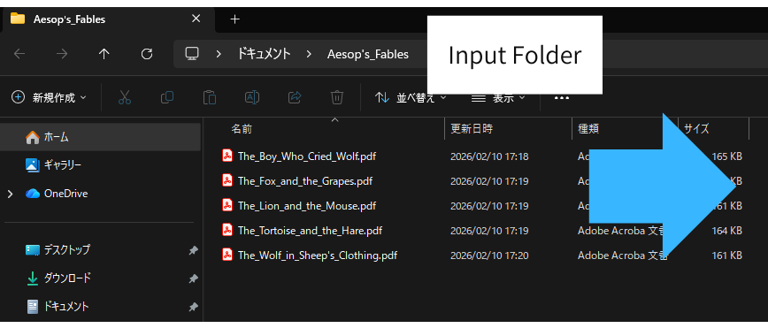
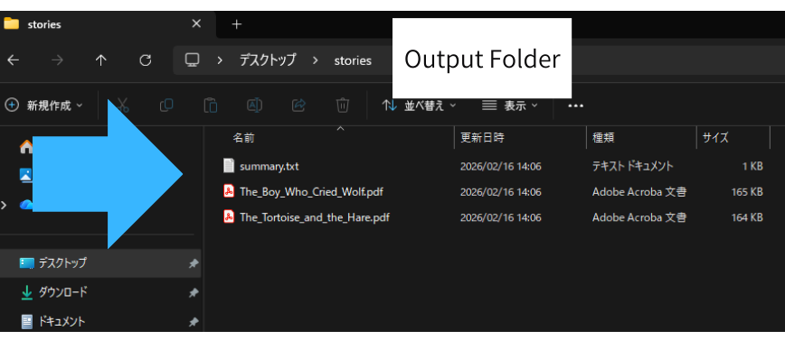

# PDF Inspector Business
*(High-Speed Bulk PDF Keyword Search Tool for Windows)*

---

## 🌐 Note for Japanese Users
日本語で読む場合はこちら → [README_JP.md](./README_JP.md)

---

## 🚨 Important Notice

**PDF Inspector Business is NOT a legal-grade document comparison tool.**  
It is designed to **quickly identify PDF files likely to contain your keywords**, helping professionals save hours of manual review.  

Perfect for:

- Professionals managing **hundreds of PDFs** daily  
- Teams reviewing **contracts, reports, specifications**  
- Anyone looking to **cut hours off repetitive PDF checks**
<!-- GIF demo -->

> Focus your time on making decisions, not digging through files.

> "I was facing hundreds of PDFs to review...  
> Now I can select the files I actually need to check in just minutes!"

---

## ✅ Who Should Use PDF Inspector Business

- Legal, compliance, or administrative teams  
- Project managers handling multiple document sources  
- Analysts who need fast, reliable **bulk PDF keyword searches**

No technical knowledge is required — just select a folder, enter your keywords, and let the software do the work.

---

## ⚡ Key Benefits / Why You'll Love It

- **Scan hundreds of PDFs instantly** (up to 300 files per run)  
- **AND / OR keyword search** to pinpoint exactly what you need  
- **Preview Mode (dry-run)** to estimate matches before extraction  
- **Automatic extraction** to a designated folder for streamlined workflow  
- **Selective OCR** for pages with insufficient text  
- **Bilingual interface**: English & Japanese  

> Transform hours of tedious PDF review into minutes.
---

### See the Transformation in File Organization

Before using PDF Inspector Business:  

After extraction and sorting:  

---
### 🏢 Common Use Cases

- Legal teams reviewing **hundreds of contract PDFs** on a Monday morning  
- Project managers checking **specifications from multiple vendors**  
- Administrative staff preparing for audits by extracting **only relevant documents**  

PDF Inspector Business helps you move from  
**reading everything**  
to **reviewing only what truly matters**.

---

## 📂 Supported PDF Types & Limitations

### Works Best With

- Digital PDFs with **selectable text**  
- Horizontal text layout documents in English or Japanese  

### May Produce Unreliable Results With

- Vertical text layout PDFs  
- Handwritten or image-only PDFs  
- PDFs with **tiny, blurred, or unclear text**  

> OCR is applied automatically when text is insufficient, but accuracy depends on document quality.

---

## 🏃 How to Get Started

1. Launch **PDF Inspector Business (exe)**  
2. Select the folder containing your PDFs (max 300 files; recommended ≤100)  
3. Enter up to 5 keywords (select from past history if needed)  
4. Choose **AND / OR** matching logic  
5. Enable **Preview Mode** to see estimated matches (optional)  
6. Click **Run** to process files  

> Preview Mode helps you plan before committing to extraction.

---

## 🔒 Privacy & Security

- **100% offline** operation — no internet connection required  
- All PDFs, extracted results, and logs remain **on your local PC**  
- No data is transmitted to third parties  

> Perfect for confidential or sensitive documents.

---

## 💳 License & Usage Terms

- **1 license per PC**  
- Additional PCs require separate licenses  
- **Perpetual license** — use indefinitely without expiration  

---

## 💰 Purchase / License Fee

- One-time purchase: **$178 (≈¥27,800 JPY)**  
- Includes **perpetual license** and **first-year updates & support**  
- The payment link is currently being prepared.
If you would like to purchase, please contact us at:　swlinkalt@gmail.com

---

## 🔄 Updates & Support

### First Year

- Includes updates and support  
- Bug fixes, feature improvements, Windows compatibility updates

### Subsequent Years

- Optional renewal for new versions and ongoing support  
- Existing version continues to work without renewal

### Renewal Policy

- Renewal within 1 year → standard 1-year renewal  
- Renewal after 1 year → reactivation (may include fee)  

> Fair and flexible support for continuous users.

---

## ⚠️ Disclaimer

- Tested in current Windows environments at release  
- OS updates may impact functionality  
- Full operation across all Windows setups **cannot be guaranteed**

---

## 📥 Re-download Policy

- Accidental deletion or PC replacement? Contact support  
- Re-download available for purchase version or within active support period  

---

## 📩 Contact

**swlinkalt@gmail.com**

---

## 🌟 SEO-Optimized Keywords for Search

- Bulk PDF keyword search Windows  
- PDF review automation tool  
- Contract and report PDF checker  
- AND OR PDF search software  
- Fast PDF document scanning  

> These keywords are optimized for search engines to help users discover PDF Inspector Business quickly.

---

💡 **Summary**

- Reduce manual PDF review by **50–70%**  
- Perform **large-scale keyword checks** quickly, accurately, and securely  
- Ideal for legal, administrative, and project management teams  
- Works with **English and Japanese PDFs**, making it suitable for global businesses
